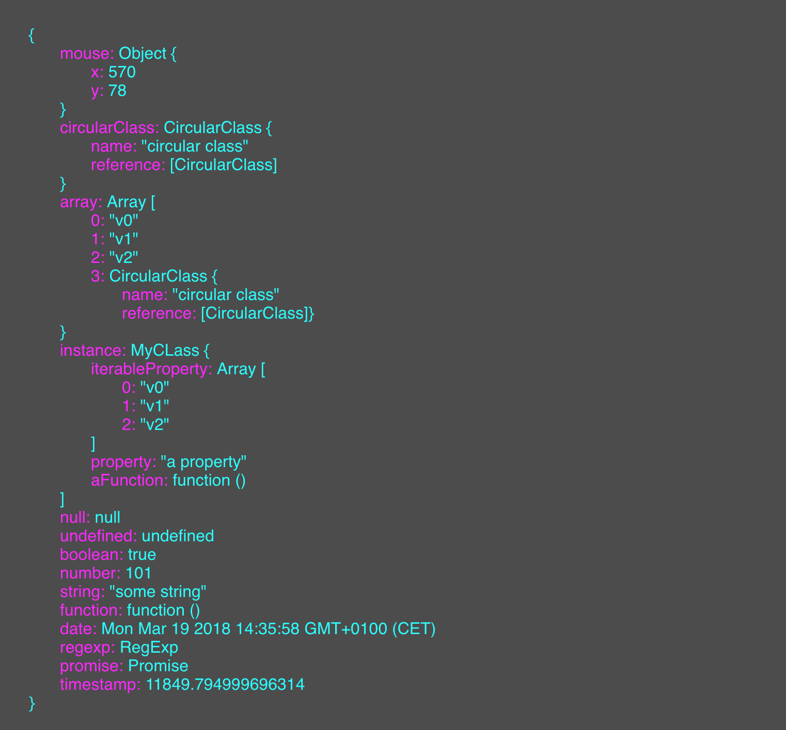

[Demo](https://germanbisurgi.github.io/js-object-debugger/)



## Why

* Make it easy to inspect objects on mobile devices without "console.log".
* Real time updates (with requestAnimationFrame or setInterval).
* Circular objects (child objects that are reference the parent) will not be
traversed but the object name will be printed between square brackets.
* customizable inspection depth.
* customizable output.

## How it works

```javascript
// The element that will be injected with the object debugger output.
var output = document.querySelector('.output');

// Object debbugger instance.
var objectDebugger = new ObjectDebugger(output);

// an object.
var object = {
    string: 'a string',
    number: 'number',
}

// print the object and set a max depth
objectDebugger.print(object, 3);
```

## Customize output
Output Keys and values have css classes for easy styling. Object debugger does
not produce the output container but it would be a good idea to style it also.

```css
.object-debugger-key {
    color: magenta;
}

.object-debugger-value {
    color: cyan;
}

.output {
    background: rgba(0, 0, 0, 0.7);
    font-family: monospace;
    overflow: auto;
    padding: 30px;
    position: fixed;
    top: 0;
    right: 0;
    bottom: 0;
    left: 0;
}
```